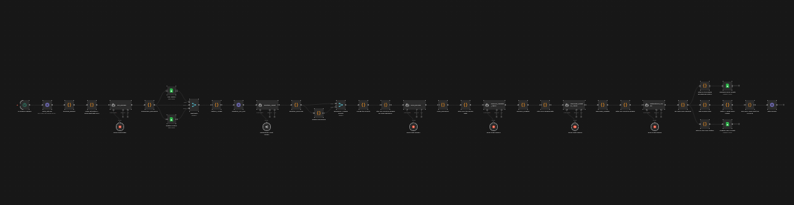
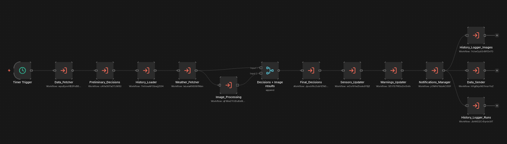

# Sahla Farm n8n Workflows

>***NOTES***:
>1. All the workflows are provided in this repo
>2. The Full_Workflow contains the sub workflows connected with each other, considered as a Modular-Friendly workflow
>3. The Full_Detailed_Workflow contains all the nodes in one single workflow line 
>4. The Data_Fetcher fetches real sensor data from their entities ant not from helpers
>5. The agent's crendentials can be used directly (API keys are from the sahla_farmer google account)
>6. Running the worklfow many times reaches the "agents' requests limit" very fast
>7. Each workflow contains a mock-up data in its input, so that you can test it directly

## Rapport :

Here are the modules and their functionalities in details:

### *1) Data Fetcher :*
each X minutes, it fetches all the states from home assistant and filter them to make the payload
for all the data, everything is initiated either to null, or to its value in the HA entity
for the actuators, each object contains its : type, status (won't be changed in the workflow), control_mode, classification (will be changed in the worklflow, and describes in each step what would be happen to the actuator), the run time, and the re evaluation 
in which we have those cases: 
first, if the control mode is SEMI-AUTO, the classifications are either ON (if the status is on), OFF (if the status if off), FUTURE-RE-EVALUATION (if the now time is in the interval of re evaluation, and in this case the actuator 'll be skipped in the workflow and won't be considered)
second,if the control mode is AUTO, there are 4 classifciations: WORKING (if it is on and running), PENDING (if it is off but 'll be running in a future time), FUTURE-RE-EVALUATION (the same logic as the semi-auto mode) (all of those classificaions force the actuator to be skipped and not considered) and the fourth case is FREE (the status is off and no action 'll be taking in the future)

### *2) Preliminary Decisions :*
this agent makes decisions on non-skipped actuators, before this agent, i made a filter to keep only the needed info to make pre decisions (on or off) which are : time, farm info, sensors 
the agent will modify the classification of the each non-skipped actuator, in which, new classification are made: TURN-ON, KEEP-OFF (for auto actuators) and TURN-ON, TURN-OFF, KEEP-ON, KEEP-OFF (for semi-auto actuators)

### *3) Weather Fetcher :*
this module fetches the weather and make a summary, give the state, the hourly data, insights (max & min) and the precipitation_probability

### *4) History Loader :*
Fetches the 3 last history (for both runs and images) and makes the 7 last days averages and statistics

### *5) Image Processing :*
whether give an image summary + flags, or refuse to take a picture (no image needed case)

### *6) Final Decisions :*
i made a code before that agent to filter only the data it needs, which is : time, farm, sensors, weather, history (only averages and 3 last runs (giving too much runs to the agent is not sufficient at all, it just needs to know the last runs as a pattern, and the averages for the week summaries)), image processing, and actuators (to see and modify on them)
the agent 'll receive only actuators that are going to be running (TURN-ON case), for the others (like KEEP-OFF..), he can't see them, and won't recommend anything for them
then, for the available actuators, it decides according to the given data, whether to run now, run later (here it updates the run object), or flag a NEED-RE-EVALUATION (modify the classification of the actuator) and set the interval for the re evaluation

the agent also make a general recommendation + updating the feedback (useful/useless/neutral(in case of re evaluation))

### *7) Sensor Updater :*
this make descriptions on the sensors (needed in the web app)

### *8) Warnings Updater :*
make description for the warnings, and set the severity

### *9) Notifications Manager :*
make weather (the forecast) + actuators (actions made on actuators) + warnings (active warnings with high severity) notifications 

### *10) History Logger :*
There are two : one for the runs and the second for the images, both sends screenshots to GOOGLE SHEETS

### *11) Data Sender :*
updates the entities in home asssitant (actuators' states, times (for both run and re-evaluation), recommended actions on "semi-auto" actuators, and also send a big json to an entity that contains sensors descriptions, warnings, recommendation and weather data

## Screenshots :

